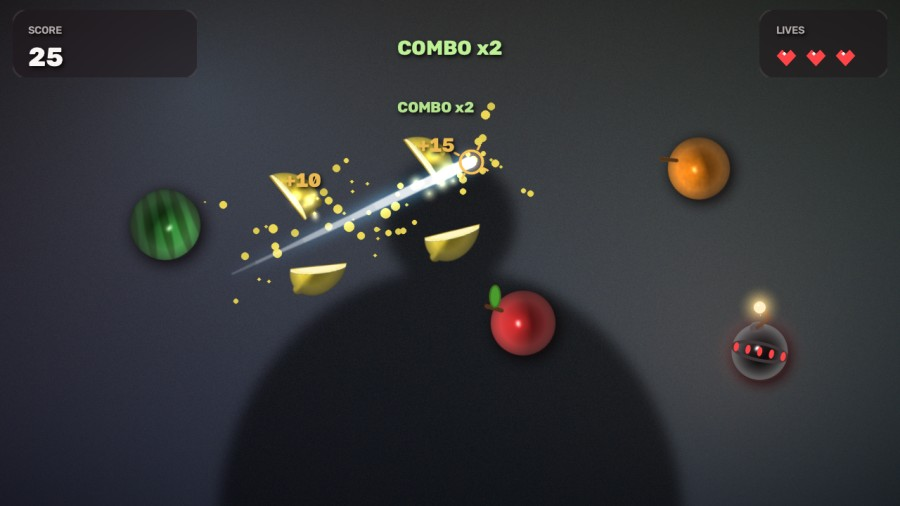
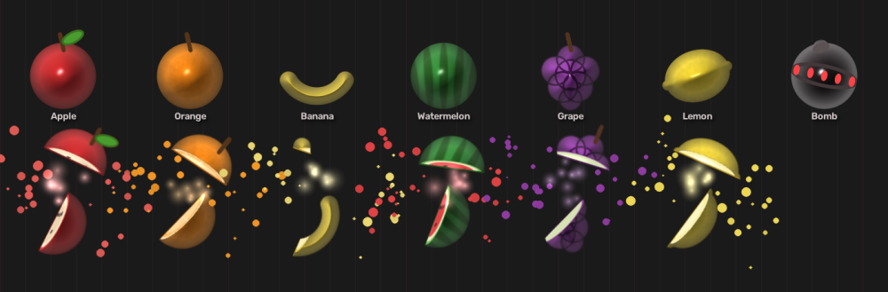
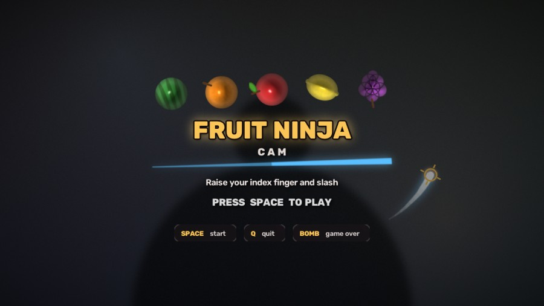

# Fruit Ninja Cam

**Webcam Fruit Ninja** powered by [Google MediaPipe Hand Landmarker](https://developers.google.com/mediapipe/solutions/vision/hand_landmarker). Your **index fingertip** (landmark 8) is the blade — swipe to slice falling fruit, dodge bombs, keep 3 lives.

Mac-first scaffold (OpenCV + MediaPipe Python Tasks). The same Hand Landmarker `.task` model runs on **Android / iOS / Web** via MediaPipe Tasks — this repo is a clean Python reference you can port.




> Screenshots are rendered headless by `scripts/render_preview.py` over a synthetic
> stand-in for the webcam feed — in the real thing that backdrop is you.

## Features

- **Index-fingertip blade trail** — MediaPipe Tasks `HandLandmarker` in `VIDEO` mode
- **Mirrored webcam** (selfie view) so motion feels natural
- **Fruit + bombs**, gravity arcs, combo scoring, 3 lives
- **Lit fruit sprites** that split into two halves with juice, sparks and screen shake
- **SPACE** start / restart · **Q** (or Esc) quit
- Model downloaded by script (not committed) — idempotent `scripts/download_models.py`
- Unit-tested game logic (collision, scoring, bomb game-over, missed fruit) — no camera required

## Quickstart (macOS)

```bash
# 1. Clone
git clone https://github.com/joexu22/fruit-ninja-cam.git
cd fruit-ninja-cam

# 2. Create a venv (recommended)
python3 -m venv .venv
source .venv/bin/activate

# 3. Install package + download hand_landmarker.task
make setup

# 4. Play
make run
# or: python -m fruit_ninja_cam
```

### macOS camera permission

The first launch will prompt for camera access. If the window stays black:

1. **System Settings → Privacy & Security → Camera**
2. Enable **Terminal**, **iTerm2**, or your IDE (VS Code / Cursor / PyCharm)
3. Quit and relaunch the app (permission changes apply to new processes)

### Tests

```bash
make test
```

### Preview the visuals without a webcam

The renderer is driven by a scripted fingertip over a synthetic backdrop, so you
can iterate on the art headless:

```bash
make preview                                  # stills into preview/
python scripts/render_preview.py --video      # 12s demo.mp4
python scripts/render_preview.py --sheet      # contact sheet of every fruit
python scripts/render_preview.py --hero       # composed action still
```



## Controls

| Key | Action |
|-----|--------|
| `SPACE` | Start game / restart after game over |
| `Q` / `Esc` | Quit |

Swipe quickly through fruit with your **index finger**. Hitting a **bomb** ends the run. Letting fruit fall off the bottom costs a life.

## How it works

```
Webcam frame ──flip──► HandTracker (MediaPipe landmark 8)
                              │
                              ▼  timed tip trail
                         Game.update (gravity, spawn, segment↔circle slice)
                              │
                              ▼
                         render overlays ──► imshow
```

1. **`hand_tracker.py`** — MediaPipe Tasks Vision `HandLandmarker` (`RunningMode.VIDEO`). Converts normalized landmark 8 → pixels; keeps a short timestamped trail. Falls back to legacy `mp.solutions.hands` if Tasks imports are unavailable.
2. **`game.py`** — Pure logic: `Fruit` / bomb dataclasses, spawn cadence, gravity, trail-segment vs circle collision with a **minimum slice speed**, score / lives / `MENU | PLAYING | GAME_OVER`. Emits a `SliceEvent` carrying the fruit's geometry and the blade angle.
3. **`theme.py`** — Bakes the fruit art (see below) and holds the palette.
4. **`effects.py`** — Transient VFX: flying halves, juice, sparks, shockwaves, screen shake.
5. **`gfx.py`** — Compositing primitives: alpha/additive blits, frosted panels, stencil text.
6. **`render.py`** — `Renderer` composites a frame: backdrop treatment, fruit, blade, VFX, HUD, menus.
7. **`main.py`** — Camera loop wiring tracker + game + render.

### How the fruit is drawn

There are no image assets. Each fruit is baked once per (kind, radius) and then
alpha-blitted every frame:

1. Draw a **silhouette** — a disc, the banana's crescent, the grape cluster.
2. Run a **distance transform** over it and map distance to height, which fakes a
   rounded surface; the gradient of that height field gives surface normals.
3. Light those normals with **Lambert + specular + rim**, over an albedo that
   carries the watermelon's stripes, the citrus speckle and the grape creases.
4. Bake at 3× and downsample for clean edges.

One shading path therefore covers every shape, and slicing reuses it: a cut
sprite is masked into two halves with a foreshortened inner face composited
along the cut, so a sliced watermelon shows red flesh and seeds.

The webcam feed is dimmed, desaturated and vignetted (`BACKDROP_*` in
`config.py`) so the art stays legible over any room lighting.

### Model

Official Google float16 bundle (not in git):

```
https://storage.googleapis.com/mediapipe-models/hand_landmarker/hand_landmarker/float16/latest/hand_landmarker.task
```

Saved to `models/hand_landmarker.task` by `scripts/download_models.py`.

## Project layout

```
fruit-ninja-cam/
  README.md
  LICENSE
  pyproject.toml
  Makefile
  .gitignore
  docs/                     # screenshots used by this README
  scripts/download_models.py
  scripts/render_preview.py # headless renderer preview / screenshot generator
  src/fruit_ninja_cam/
    __init__.py
    __main__.py
    main.py
    hand_tracker.py
    game.py
    theme.py
    effects.py
    gfx.py
    render.py
    config.py
  tests/test_game_logic.py
  tests/test_render.py
```



## Android-ready note

This demo uses the same **MediaPipe Tasks Hand Landmarker** model and landmark indices as Google’s Android / iOS samples. A mobile port can reuse:

- Landmark **8** as the blade tip
- Segment–circle slice tests against projected fruit
- The downloaded `hand_landmarker.task` asset (or the Gradle download task from [mediapipe-samples](https://github.com/google-ai-edge/mediapipe-samples))

Python here is the fastest way to iterate on feel; MediaPipe keeps inference portable.

## Interview / demo talking points

- End-to-end **ML → interaction → game loop** with a production Google model
- **Tasks API** (not only legacy solutions), VIDEO timestamps, trail-based slash detection
- Separated **pure game logic** (unit-tested) from I/O and rendering
- **Procedural sprite art** — normals faked from a distance transform, so every fruit
  is lit by one shading path and there are no binary assets in the repo
- Renderer is testable and previewable **headless**, on an injectable clock
- Mac-first DX: Makefile, editable install, camera permission docs

## Requirements

- Python 3.10+
- Webcam
- Dependencies: `mediapipe`, `opencv-python`, `numpy` (see `pyproject.toml`)

## License

MIT © 2026 Joe Xu — see [LICENSE](LICENSE).
